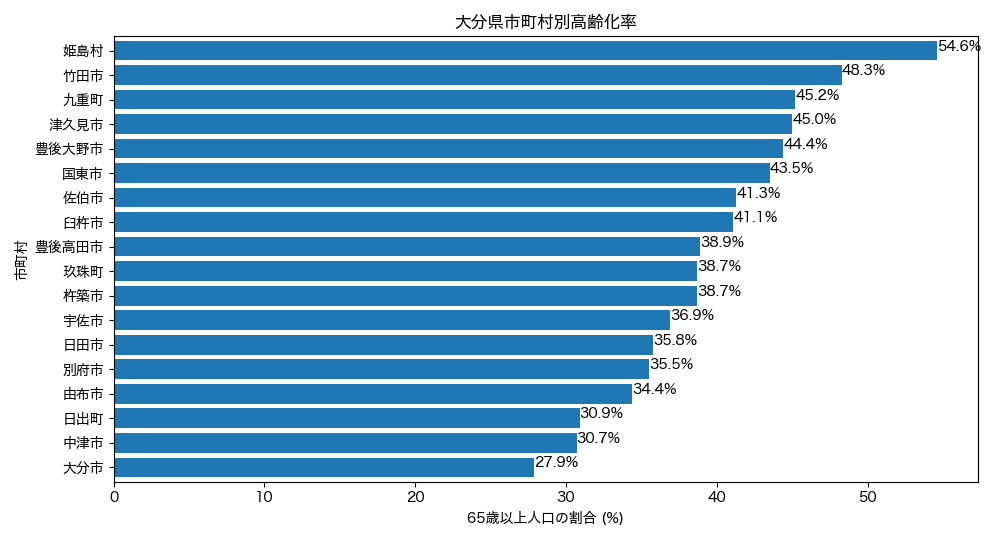
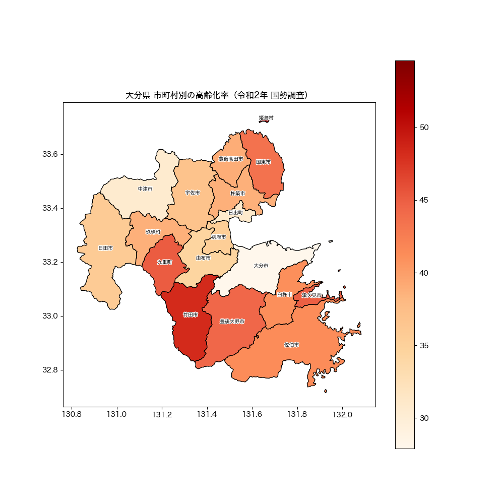
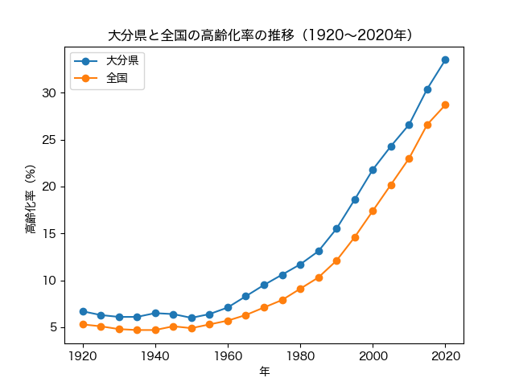
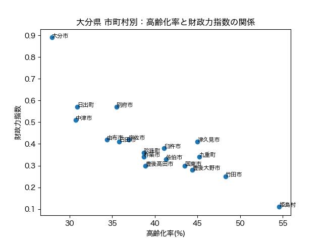

# 都道府県の高齢化を可視化する分析ツール（既定：大分県）

政府統計API（**e-Stat API**）から令和2年 国勢調査などのデータを自動取得し、
市町村別の**高齢化率（65歳以上人口の割合）**を、棒グラフ・地図（GIS）・時系列・散布図の4つの視点で可視化・分析するツールです。
**`config.py` の都道府県名を変えるだけで、全国どの都道府県でも同じ分析ができます**（既定は大分県）。

### 市町村別の高齢化率（棒グラフ）


### 高齢化率の地理的分布（コロプレス図）


### 高齢化率の推移：大分県 vs 全国（折れ線）


### 高齢化率と財政力指数の関係（散布図）


## 何を・なぜ分析したか

- **何を**：大分県内18市町村ごとの高齢化率を比較し、地域差を可視化。
- **なぜ**：高齢化は身近で分かりやすい地域課題。市町村単位で見ると、
  同じ県内でも実態が大きく異なることをデータで示したかった。

## 分かったこと

| | 市町村 | 高齢化率 |
|---|---|---|
| 最も高い | 姫島村 | **54.6%** |
| 最も低い | 大分市 | **27.9%** |

- 県内の差は **26.7ポイント**。県庁所在地の大分市は約4人に1人が高齢者である一方、
  姫島村では**2人に1人以上**が高齢者で、同じ県内でも状況が大きく違う。
- 県全体（県庁所在地に人口が集中）の数字だけを見ると、
  小規模な町村が抱える高齢化の深刻さは見えづらい——市町村単位で見る意味がここにある。
- **地図で見ると地理的な傾向が浮かぶ**：高齢化率が高いのは県の周縁部・山間部・離島（姫島村・竹田市など）、
  低いのは県庁所在地の大分市とその周辺。人が集まる中心部ほど若く、周縁ほど高齢化が進む構図が一目で分かる。
- **時間で見ると進み方が分かる**：大分県の高齢化率は1920年の6.7%から2020年には33.5%へ上昇。
  特に1980年代から急加速し、全国平均より一貫して高い（＝全国より早く高齢化が進行している）。
- **別データと結びつけると課題が見える**：高齢化率と財政力指数を市町村コードで結合すると、
  **高齢化が進む市町村ほど財政力が低い**という関係が浮かぶ（大分市：高齢化27.9%・財政力0.89 ↔ 姫島村：54.6%・0.11）。
  つまり「最も支援が必要な町ほど、道路・水道・公共施設を維持する体力が乏しい」という構図が読み取れる。

## 使ったデータ（出典）

- **政府統計の総合窓口（e-Stat）** 国勢調査 令和2年
  「年齢（3区分），男女別人口及び年齢別割合 － 都道府県，市区町村」
  （statsDataId = `0003448299`）
- 取得方法：e-Stat API（手動ダウンロードではなくプログラムから自動取得）
- 時系列データ：e-Stat 国勢調査「年齢（3区分）別人口及び年齢別割合 － 全国，都道府県（大正9年〜令和2年）」
  （statsDataId = `0003410383`）
- 地図の境界データ：国土交通省「国土数値情報（行政区域）」を加工した市区町村GeoJSON
  （[smartnews-smri/japan-topography](https://github.com/smartnews-smri/japan-topography)）をURLから読み込み。
- 財政データ：e-Stat 社会・人口統計体系「市区町村データ（Ｄ 行政基盤）」の財政力指数
  （statsDataId = `0000020204` / 2021年度）

## 使った技術

- **Python**（標準ライブラリ `urllib` でAPI通信、`json` で解析、`os` でフォルダ操作）
- **pandas**（データの整形・並べ替え・テーブル結合）
- **matplotlib**（棒グラフ・折れ線・散布図の描画、日本語フォント対応）
- **geopandas**（地図データ(GeoJSON)の読み込み、市町村コードでの結合、コロプレス図の描画）
- **設計**：設定ファイル（`config.py`）で全国対応、各分析を関数化し `main.py` で一括実行

## 工夫した点

- **全国対応（設定1か所）**：`config.py` の `PREF_NAME` を変えるだけで全47都道府県に対応。
  都道府県名→コードの変換表を内蔵し、地図URLや地域フィルタを自動で切り替える。
- **1コマンドで一括出力**：各分析を関数（`def run()`）にまとめ、`main.py` から呼び出して
  `python3 main.py` で4枚をまとめて生成（各ファイル単体での実行も可能）。
- **出力の自動整理**：画像を `images/{県名}/` に保存。フォルダが無ければ `os.makedirs(exist_ok=True)` で自動作成。
- **県ごとの差異への対応**：市町村数に応じてグラフの高さを自動調整。離島が極端に離れた東京都は
  本土へズームし離島を別枠（インセット）で表示（多島県の完全対応は今後の課題）。
- **API取得の自動化**：手入力ではなくAPIを叩いて取得。データが更新されても再実行するだけで作り直せる。
- **入れ子のJSONを読み解く**：返ってきたデータの `CLASS_INF` から「地域コード→市町村名」の
  変換表を作り、コード（`44201`）を市町村名（大分市）に変換した。
- **市町村の正確な抽出**：地域コードは**文字列**なので `"44000"`（文字）で比較する必要があり、
  数値の `44000` では一致せず除外できなかった——この原因をデータを確認して特定・修正した。
- **別々のデータを共通コードで結合**：地図（国土交通省）と高齢化率・財政力（総務省）という出所の異なるデータを、
  全国共通の市町村コードを鍵に結合。突合時の欠損（片方にしか無い市町村）にも備えた。
- **APIキーの安全な管理**：キーはコードに直書きせず `appid.txt` から読み込み、`.gitignore` で公開対象から除外。

## 実行方法

1. [e-Stat](https://www.e-stat.go.jp/) でユーザー登録し、APIの**アプリケーションID（appId）**を発行する（無料）。
2. このフォルダに `appid.txt` を作り、発行したappIdを1行で貼り付ける。
3. （初回のみ）必要なライブラリを入れる：
   ```bash
   pip install pandas matplotlib geopandas
   ```
4. `config.py` の `PREF_NAME` を分析したい都道府県に設定する（既定は `"大分県"`。例：`"東京都"`）。
5. 実行：
   ```bash
   python3 main.py
   ```
   → `images/{県名}/` に4枚の画像（棒グラフ・地図・推移・財政力）が出力される。

> 各分析を個別に実行することもできる（例：`python3 aging_bar.py`）。

## ファイル構成

| ファイル | 内容 |
|---|---|
| `config.py` | **設定**。対象の都道府県（`PREF_NAME`）と保存先を管理。ここを変えるだけで全国対応 |
| `main.py` | **これ1つ実行**で4つの分析画像をまとめて出力 |
| `aging_bar.py` | 棒グラフ（市町村別の高齢化率を順位で比較） |
| `aging_map.py` | 地図（コロプレス図。東京都は離島を別枠表示） |
| `aging_trend.py` | 時系列（対象県 vs 全国の推移、1920〜2020年） |
| `aging_scatter.py` | 散布図（高齢化率 × 財政力指数の関係） |
| `aging_demo.py` | 学習初期のデモ版（手入力サンプル値。記録として残置） |
| `images/{県名}/` | 出力画像の保存先（自動作成） |
| `appid.txt` | APIキー（**Git管理外**。各自で用意） |

---

> 補足：本リポジトリは、データで地域課題を捉える練習として作成しました。
> 棒グラフで「順位」を、地図（コロプレス図）で「地理的な分布」を、折れ線で「時間的な推移」を、
> 散布図で「別データ（財政力）との関係」を示しています。
> さらに `config.py` を変えるだけで全国どの都道府県でも同じ4分析ができる、再利用可能なツールにしています。
