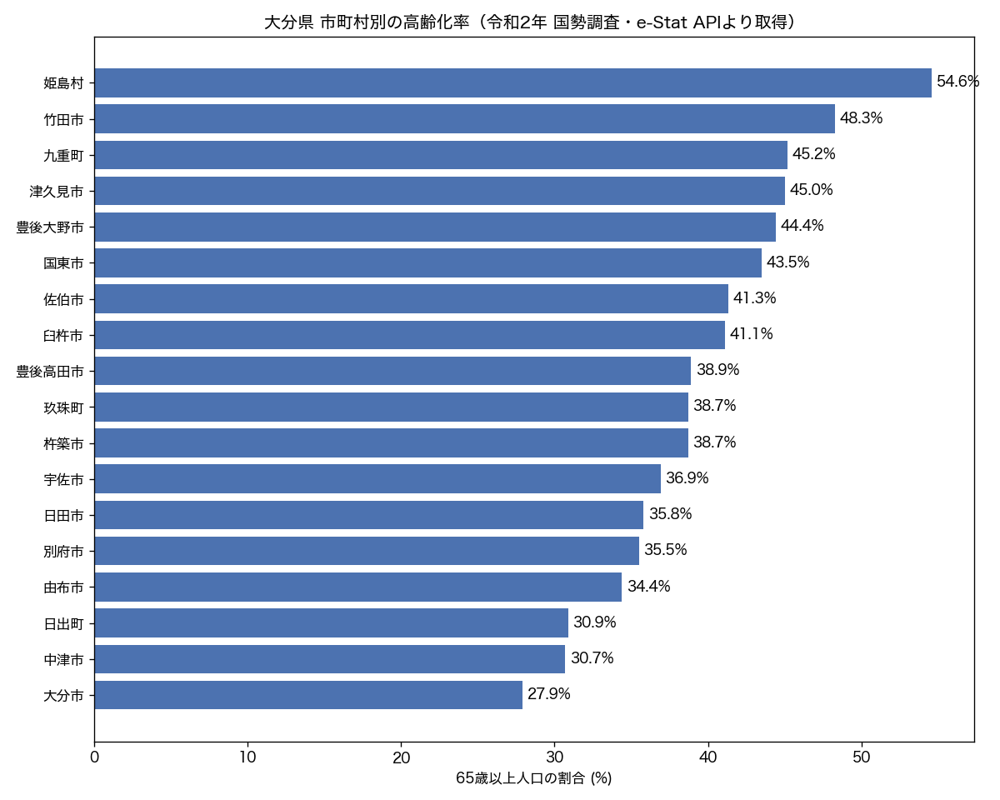

# 大分県 市町村別 高齢化率の可視化

政府統計API（**e-Stat API**）から令和2年 国勢調査のデータを自動取得し、
大分県内18市町村の**高齢化率（65歳以上人口の割合）**を可視化したものです。



## 何を・なぜ分析したか

- **何を**：大分県内18市町村ごとの高齢化率を比較し、地域差を可視化。
- **なぜ**：高齢化は身近で分かりやすい地域課題。市町村単位で見ると、
  同じ県内でも実態が大きく異なることをデータで示したかった。

## 分かったこと

| | 市町村 | 高齢化率 |
|---|---|---|
| 最も高い | 姫島村 | **54.6%** |
| 最も低い | 大分市 | **27.9%** |

- 県内の差は **26.7ポイント**。県庁所在地の大分市は約4人に1人が高齢者である一方、
  姫島村では**2人に1人以上**が高齢者で、同じ県内でも状況が大きく違う。
- 県全体（県庁所在地に人口が集中）の数字だけを見ると、
  小規模な町村が抱える高齢化の深刻さは見えづらい——市町村単位で見る意味がここにある。

## 使ったデータ（出典）

- **政府統計の総合窓口（e-Stat）** 国勢調査 令和2年
  「年齢（3区分），男女別人口及び年齢別割合 － 都道府県，市区町村」
  （statsDataId = `0003448299`）
- 取得方法：e-Stat API（手動ダウンロードではなくプログラムから自動取得）

## 使った技術

- **Python**（標準ライブラリ `urllib` でAPI通信、`json` で解析）
- **pandas**（データの整形・並べ替え）
- **matplotlib**（横棒グラフの描画、日本語フォント対応）

## 工夫した点

- **API取得の自動化**：手入力ではなくAPIを叩いて取得。データが更新されても再実行するだけで作り直せる。
- **表構造に強いコード**：メタ情報（getMetaInfo）から「65歳以上」「割合」などのコードを
  名前で自動特定。表番号やコード体系が変わっても壊れにくくした。
- **市町村の正確な抽出**：地域コード（44始まり）から県合計（44000）だけを除外して18市町村を抽出。
  当初コード末尾0を一律除外して杵築市（44210）が漏れたが、データを突き合わせて原因を特定し修正。
- **APIキーの安全な管理**：キーはコードに直書きせず `appid.txt` / 環境変数から読み込み、
  `.gitignore` で公開対象から除外。

## 実行方法

1. [e-Stat](https://www.e-stat.go.jp/) でユーザー登録し、APIの**アプリケーションID（appId）**を発行する（無料）。
2. このフォルダに `appid.txt` を作り、発行したappIdを1行で貼り付ける。
   （または環境変数 `ESTAT_APP_ID` に設定）
3. 実行：
   ```bash
   python3 oita_aging_api.py
   ```
4. `oita_aging.png` にグラフが出力され、最も高い/低い市町村と県内の差がコンソールに表示される。

## ファイル構成

| ファイル | 内容 |
|---|---|
| `oita_aging_api.py` | **本番版**。e-Stat APIから取得して可視化 |
| `oita_aging.png` | 出力されるグラフ画像 |
| `oita_aging.py` | 学習初期のデモ版（手入力サンプル値。記録として残置） |
| `appid.txt` | APIキー（**Git管理外**。各自で用意） |

---

> 補足：本リポジトリは、データで地域課題を捉える練習として作成しました。
> 次の発展として、市町村を地図上に色分けする**コロプレス図（GIS）**への拡張を検討しています。
